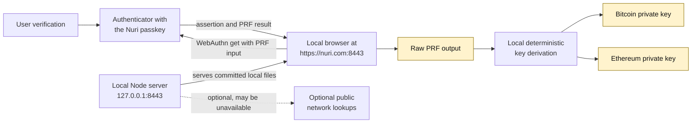
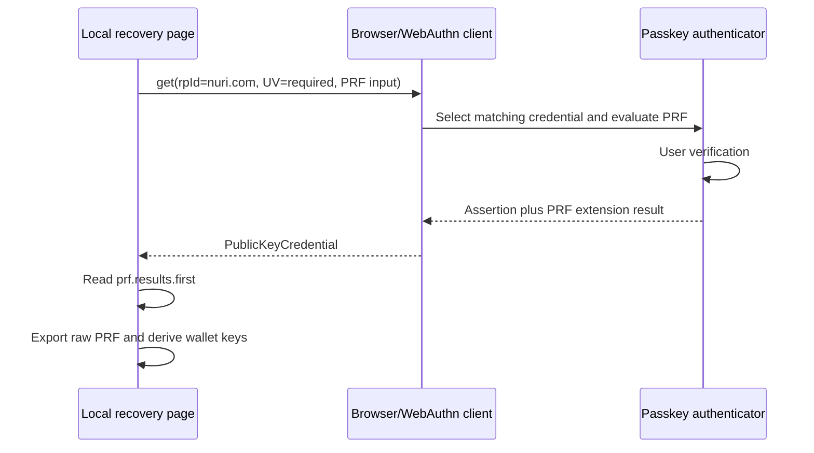
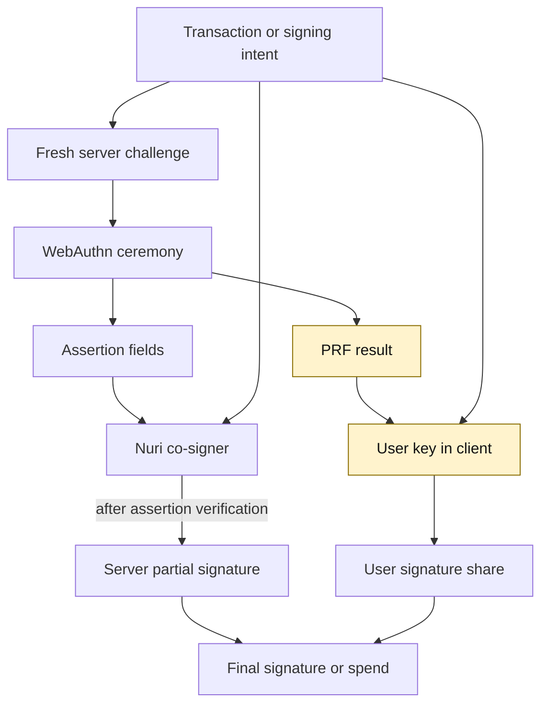
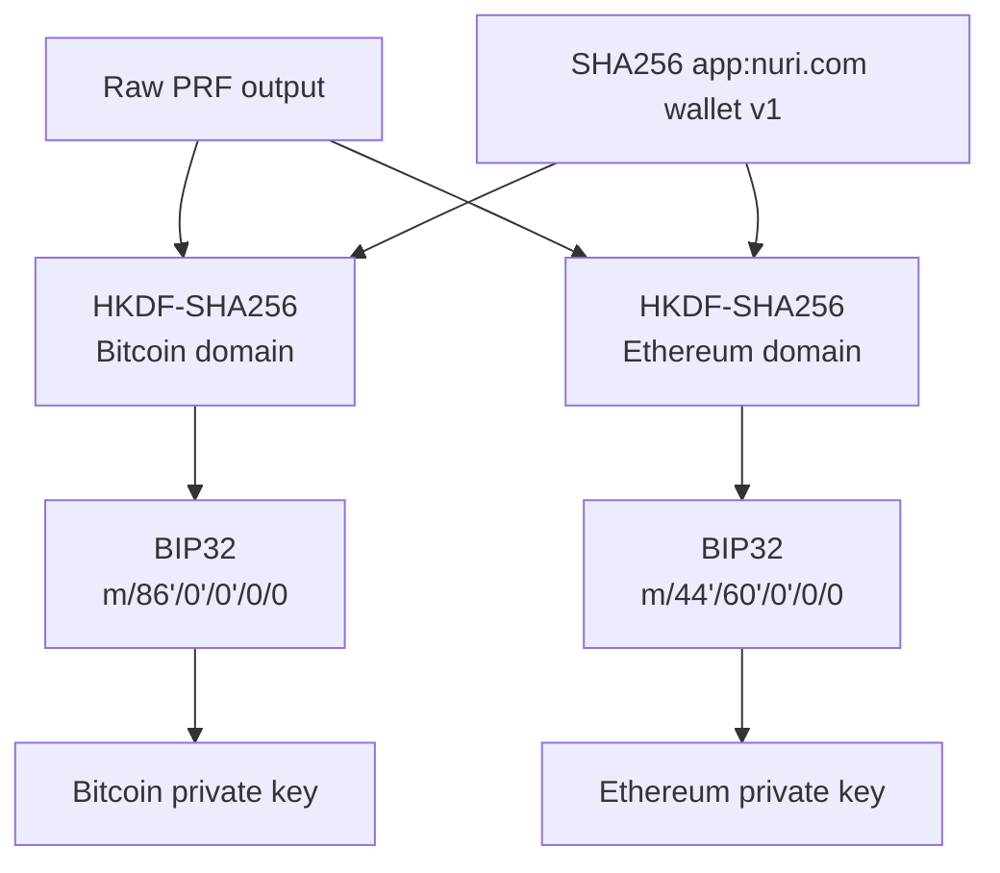
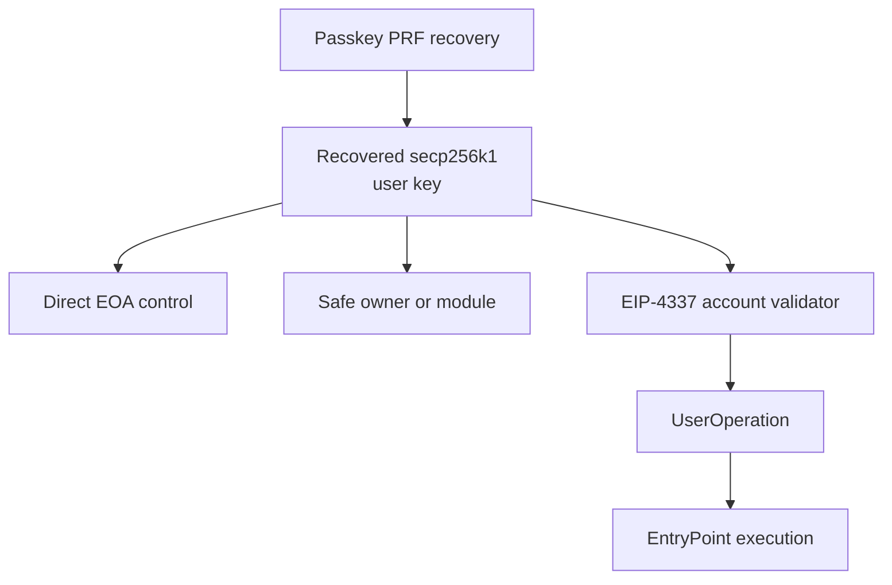
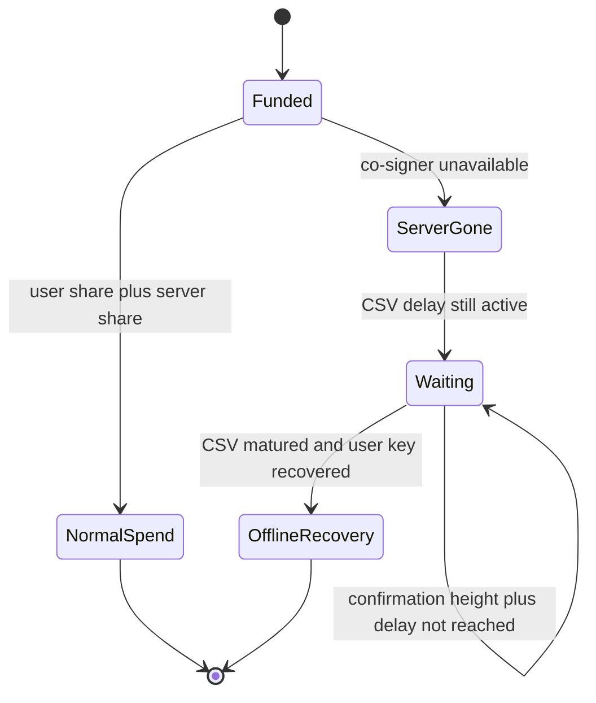

# Nuri Passkey PRF Recovery

Recover the raw WebAuthn PRF output and the Nuri Bitcoin and Ethereum private keys locally, even when every Nuri server is gone and nobody controls `nuri.com` anymore.

- [Open Nuri Web](https://app.nuri.com)
- [Open the Nuri app on your device](https://link.nuri.com/app)
- [Why provider-independent recovery matters](https://www.nuri.com/blog/what-stripes-investor-letter-means-for-nuri)

> This is an emergency recovery tool. It deliberately shows the raw PRF output and private keys. That is the product, not a leak. Run reviewed source on a trusted computer, disconnect that computer from the network, recover, then remove the temporary local certificate and hosts entry.

## Basically

A Nuri passkey does not only prove that you are you.

Its PRF capability can give you the same secret again. Nuri turns that secret into your Bitcoin and Ethereum keys with public, deterministic math.

No Nuri API has to return the secret. No employee has to approve an export. No server database has to survive.

If Nuri disappears, your passkey can still reproduce your keys offline.

## The most important distinction

You do **not** need:

- a working `nuri.com` website
- public DNS for `nuri.com`
- a valid public certificate issued to Nuri
- `app.nuri.com`
- `sign.nuri.com`
- `arkade.nuri.com`
- a Nuri database, enclave, API, employee, or export button

You **do** need to reproduce the RP ID `nuri.com` locally because the passkey is cryptographically domain-bound.

That sounds contradictory. It is not.

```text
Public internet nuri.com: not needed
The string "nuri.com" as the WebAuthn RP ID: required
```

The recovery setup writes this local hosts entry:

```text
127.0.0.1 nuri.com
```

Your browser therefore does not ask DNS where `nuri.com` is. It opens the recovery server on your own machine. A locally generated and locally trusted TLS certificate makes that page a secure `https://nuri.com` origin.

Nothing is fetched from the real domain to recover the PRF or private keys.

## Basically

The passkey remembers the name `nuri.com`.

The company and website may be gone. Your own computer can still use that name locally and open this recovery code instead.

The browser sees the correct RP ID. The passkey asks for Face ID, Touch ID, a PIN, or security-key confirmation. Then the authenticator gives the local page the PRF result.

## Quick offline recovery

Requirements:

- the original Nuri passkey is still available through your operating system, password manager, phone, or hardware authenticator
- the authenticator and browser support the WebAuthn `prf` extension for that credential
- Node.js 20 or newer
- OpenSSL
- administrator access to add temporary local certificate trust and one hosts entry

The committed browser bundle already contains the JavaScript dependencies. Running the recovery tool does not require `npm install`.

### macOS or Linux

```sh
./scripts/setup-local.sh
```

Disconnect the computer from Wi-Fi and Ethernet. Then start the local server:

```sh
./run.sh
```

Open:

```text
https://nuri.com:8443
```

Then:

1. Click **Recover Keypairs**.
2. Approve the Nuri passkey operation.
3. Wait for optional server lookups to fail harmlessly if the machine is offline.
4. Copy the raw PRF, Bitcoin private key, Bitcoin WIF, and Ethereum private key from the local page or its export JSON.
5. Close the tab and stop the local server.
6. Remove the `127.0.0.1 nuri.com` hosts entry, delete the locally trusted `Nuri Offline Recovery Local CA`, and delete `certs/`.

### Windows

Run PowerShell as Administrator:

```powershell
Set-ExecutionPolicy -Scope Process Bypass
.\scripts\setup-windows.ps1
```

Disconnect the computer from the network, then run:

```powershell
.\run.ps1
```

Open `https://nuri.com:8443`. After recovery, remove the hosts entry, remove the local CA from `Cert:\LocalMachine\Root`, and delete `certs\`.

## What runs offline and what does not

The recovery core is entirely local:

- WebAuthn credential selection
- user verification
- PRF evaluation
- raw PRF export
- HKDF-SHA256
- BIP32 derivation
- Bitcoin key and address construction
- Ethereum key and address construction
- recovery-dump parsing
- CSV transaction construction and signing

The tool also contains optional online helpers for public metadata, UTXO discovery, and transaction broadcast. When the machine is disconnected, those requests fail and key recovery still completes.

Optional online endpoints in the current code:

- `https://arkade.nuri.com/v4/arkade/info`
- `https://sign.nuri.com/v1/info`
- `https://sign.nuri.com/v2/auth`
- `https://mempool.space/api`

These are not used to calculate the PRF or private keys.



## Why a normal passkey is not enough

A normal WebAuthn passkey contains an authenticator-held signing key.

The browser can ask the authenticator to sign a challenge. The authenticator returns an assertion. WebAuthn does not provide an API for exporting that passkey private key.

That is useful for authentication, but an assertion is not a deterministic wallet secret.

Nuri uses the WebAuthn PRF extension. PRF lets the relying party provide an input and receive a stable pseudorandom result tied to that credential.

For Nuri:

```text
RP ID:       nuri.com
PRF input:   UTF8("nuri-prf-salt-v1")
PRF output:  32 secret bytes returned locally after user verification
```

The raw PRF output is then used as input to public wallet derivation functions.

| Object | Purpose | Exported by this tool? | Sent to a Nuri signer? |
| --- | --- | --- | --- |
| Passkey private key | Signs WebAuthn assertions inside the authenticator | No, WebAuthn does not expose it | No |
| WebAuthn assertion | Proves user presence, user verification, origin, RP ID, and challenge approval | Public proof fields | Yes, when authorizing server co-signing |
| PRF output | Deterministic secret used for wallet derivation | **Yes, offline** | **No** |
| Bitcoin user private key | Signs the user's Bitcoin share or recovery path | **Yes, offline** | **No** |
| Ethereum private key | Controls the derived Ethereum account or configured owner role | **Yes, offline** | **No** |

## Exact WebAuthn PRF ceremony

The recovery page effectively requests:

```js
{
  challenge: random32Bytes(),
  rpId: "nuri.com",
  timeout: 120000,
  userVerification: "required",
  extensions: {
    prf: {
      eval: {
        first: utf8("nuri-prf-salt-v1")
      }
    }
  }
}
```

The implementation is in [`src/browser/app.js`](src/browser/app.js).

1. `navigator.credentials.get()` asks for a credential under RP ID `nuri.com`.
2. The browser or operating system offers the matching Nuri passkey.
3. The user verifies locally.
4. The authenticator creates a normal WebAuthn assertion.
5. The browser exposes `credential.getClientExtensionResults().prf.results.first` to the local page.
6. The page exports that raw PRF and derives the wallet keys.

Some WebAuthn implementations do not return PRF during credential discovery. The tool therefore supports a second request using `evalByCredential` after it learns the selected credential ID.

The credential ID is not a secret. It identifies which passkey should evaluate the PRF.



## Why the locally recreated domain works

WebAuthn does not ask whether Nuri GmbH still exists. It checks browser security properties.

The browser checks that:

- the page is a secure context
- the page hostname is compatible with RP ID `nuri.com`
- the TLS certificate is trusted by this computer
- the authenticator has a credential for that RP ID
- the user approves the ceremony

The browser does not require the page to contact a Nuri server.

For this recovery tool:

```text
Browser URL:  https://nuri.com:8443
Hostname:     nuri.com
Port:         8443
RP ID:        nuri.com
RP ID hash:   SHA256("nuri.com")
Network peer: 127.0.0.1
```

The port belongs to the web origin but not to the RP ID. The local certificate and hosts mapping recreate the secure relying-party context on the user's machine.

This is not a WebAuthn bypass. A random attacker still needs the user's passkey and user verification. It is also not a forged public certificate. The user creates and trusts a private local CA only on the recovery machine.

## Basically

Domain binding protects the passkey from random websites.

It does not force the user to depend forever on the company that once operated that domain.

The user can recreate the correct secure origin locally, use the real passkey, and recover the deterministic secret without contacting the old provider.

## PRF and server co-signing are separate

Nuri uses two outputs from a passkey ceremony for different jobs:

1. The **PRF result** unlocks or recreates the user's wallet key locally.
2. The **WebAuthn assertion** proves to the server that the user approved the server's co-signing action.

The server does not need the PRF output to verify an assertion.

The standard assertion contains:

- credential ID
- `clientDataJSON`
- `authenticatorData`
- assertion signature

The assertion signature verifies over:

```text
authenticatorData || SHA256(clientDataJSON)
```

A signer can verify the challenge, exact origin, RP ID hash, user-presence flag, user-verification flag, credential binding, signature, and freshness. If valid, it contributes its own signature share.

The PRF output and user private key remain client-side.



In this offline recovery tool there is no remote co-signing operation. The browser assertion exists because PRF is evaluated during a WebAuthn assertion ceremony, but the assertion fields are not sent to Nuri for key recovery.

## Basically

The server gets proof that you approved its signature.

It does not get the secret that creates your signature.

That is why the server can help during normal operation without being the only way to recover the user key.

## Exact Nuri wallet derivation

Constants:

```text
RP_ID       = "nuri.com"
PRF_INPUT   = UTF8("nuri-prf-salt-v1")
KDF_DOMAIN  = UTF8("app:nuri.com|wallet|v1")
KDF_SALT    = SHA256(KDF_DOMAIN)
```

Let `PRF` be the 32 bytes returned as `prf.results.first`.

### Bitcoin

```text
BTC_INFO    = UTF8("app:nuri.com|wallet|v1|chain=bitcoin|fmt=taproot")
BTC_ENTROPY = HKDF-SHA256(
                ikm  = PRF,
                salt = SHA256(UTF8("app:nuri.com|wallet|v1")),
                info = BTC_INFO,
                len  = 32
              )
BTC_KEY     = BIP32(BTC_ENTROPY).derive("m/86'/0'/0'/0/0")
```

The tool exports:

- Bitcoin private key in hex
- Bitcoin private key in WIF
- compressed secp256k1 public key
- x-only internal public key
- BIP341 Taproot output key
- mainnet BIP86 address

### Ethereum

```text
ETH_INFO    = UTF8("app:nuri.com|wallet|v1|chain=ethereum|fmt=secp256k1")
ETH_ENTROPY = HKDF-SHA256(
                ikm  = PRF,
                salt = SHA256(UTF8("app:nuri.com|wallet|v1")),
                info = ETH_INFO,
                len  = 32
              )
ETH_KEY     = BIP32(ETH_ENTROPY).derive("m/44'/60'/0'/0/0")
```

The Ethereum address is:

```text
last20Bytes(Keccak256(uncompressedPublicKeyWithout04Prefix))
```

It is displayed with an EIP-55 checksum.

Domain-separated HKDF `info` values ensure that Bitcoin and Ethereum do not reuse the same derived private key.



## Why this is different from Privy export

Privy supports non-custodial wallets and private-key export. That export is a real escape hatch.

The architectural difference is **when provider infrastructure is required**.

Privy's documented wallet architecture uses an authentication share and an enclave-backed share. Before export, signing and key reconstruction depend on Privy-operated infrastructure. If the user exported in time, the exported key can survive Privy. If the provider disappears before export, the documented recovery path still depended on the provider being available.

Nuri PRF recovery starts from a secret reproduced by the user's own passkey authenticator. The derivation code and constants are public. The provider does not have to release a share at recovery time.

| Question | Nuri Passkey PRF | Privy export model |
| --- | --- | --- |
| Can the user obtain a portable private key? | Yes | Yes, through export |
| Must the provider be online at the moment of key recovery/export? | **No** | **Yes, before export** |
| Does recovery start from user-held cryptographic material? | Yes, passkey PRF | Export depends on provider wallet infrastructure |
| Must the user remember to export before an outage or shutdown? | **No** | **Yes** |
| Can normal signing still use provider infrastructure? | Yes, for Nuri co-signing | Yes |
| Does provider loss automatically make every Bitcoin output immediately spendable? | No, wallet policy and CSV delay still apply | Depends on the exported wallet model |

Sources:

- [Privy wallet infrastructure architecture](https://docs.privy.io/security/wallet-infrastructure/architecture)
- [Privy private-key export](https://docs.privy.io/wallets/wallets/export)

## Basically

Export is independence only after you exported.

Nuri recovery does not need the provider to be alive for one final request.

Your passkey and public code are enough to reproduce the user key offline.

## Why this is different from ordinary domain-bound passkeys

A standard domain-bound passkey normally proves identity to a server. It does not reveal a reusable secret to the website.

If the website disappears, the passkey may still exist, but a sequence of old assertions cannot be converted into the authenticator's private key.

PRF changes what the client can recover:

```text
ordinary passkey:
  challenge -> assertion proof

passkey with PRF:
  challenge + PRF input -> assertion proof + deterministic secret output
```

The deterministic output remains domain-bound because the authenticator evaluates it for the same credential and RP context. The local-origin reconstruction satisfies that context without depending on live Nuri infrastructure.

This recovery still fails if:

- the original passkey is gone
- the provider restored a different credential rather than the same passkey
- the authenticator does not support PRF for that credential
- the PRF input or wallet derivation constants are wrong
- the recovery page is served under the wrong RP ID

## Why EIP-4337 does not solve this problem

[EIP-4337](https://eips.ethereum.org/EIPS/eip-4337) defines account abstraction through `UserOperation`, bundlers, an EntryPoint contract, optional paymasters, and account-defined validation.

It is an execution and validation architecture. It does **not** define:

- how a passkey produces wallet key material
- how a user exports or recovers a private key
- how an origin-bound WebAuthn credential works after a provider disappears
- how a hosted MPC or enclave share becomes available offline
- how Bitcoin keys or Bitcoin CSV recovery work

A 4337 smart account may use a passkey validator, P-256 verification, a Safe module, session keys, guardians, or key rotation. Those are account-specific choices. EIP-4337 itself does not guarantee provider-independent recovery.

Nuri PRF recovery sits below that layer:

```text
Passkey PRF
    -> deterministic user secret
    -> secp256k1 Ethereum key
    -> EOA, Safe owner, or account-abstraction signer depending on wallet configuration
```

If the recovered Ethereum key is configured as an owner or validator for a smart account, it can continue to authorize that account according to the deployed contract. If it was never configured there, recovering the key does not magically change the contract.



The same PRF recovery also derives the Bitcoin user key. EIP-4337 is Ethereum-specific and says nothing about Bitcoin, Lightning, MuSig2, Taproot, or CSV.

## Basically

4337 can make an Ethereum account programmable.

It does not tell you where the user's root secret comes from, who can recover it, or whether the provider must still be online.

Nuri PRF answers that lower-level ownership question.

## Bitcoin co-signing and CSV independence

The recovered Bitcoin private key is the user's key.

For a normal direct BIP86 output, that key directly controls the derived address.

For Nuri outputs built with a server co-signer, the normal path may use the user key and server key together. Provider-independent recovery then depends on the onchain recovery path.

Legacy Nuri Taproot CSV descriptors have this shape:

```text
tr(
  <MuSig2 aggregate x-only internal key>,
  and_v(
    v:pk(<user x-only key>),
    older(<CSV block delay>)
  )
)
```

Normal path:

```text
user signature share + server signature share -> key-path spend
```

Recovery path after CSV:

```text
user signature + relative timelock + Taproot script proof -> user-only script-path spend
```



For block-based CSV:

```text
unlock_height = confirmation_height + csv_blocks
blocks_remaining = max(0, unlock_height - current_tip_height)
```

The private key is recoverable offline immediately. The onchain script may still require waiting. That is not provider custody. It is a public Bitcoin consensus rule committed into the output.

To reconstruct and sweep legacy CSV outputs, the tool may also need public metadata:

- server/cosigner public key
- CSV delay
- descriptor or Taproot tree data
- outpoints and confirmation heights

Arkade v4 recovery needs an Arkade recovery backup or equivalent public recovery bundle to enumerate VTXOs and TapTrees after server loss. The passkey reproduces the user key, not unknown public wallet state.

## Recovery dump import

The tool can import a Nuri CSV export, Arkade v4 recovery backup plaintext, public envelope, or descriptor JSON.

Without the passkey, a dump can still be useful for:

- rebuilding watch-only Taproot CSV addresses
- locating UTXOs when chain access is available
- calculating CSV unlock height
- checking whether a dumped Bitcoin private key matches the CSV user key
- building and signing a sweep if the dump contains the matching private key

Supported descriptor form:

```text
tr(<taproot-internal-xonly>,and_v(v:pk(<user-xonly>),older(<csv-blocks>)))
```

The tool can build a signed raw transaction before CSV unlock for inspection. It refuses its own broadcast action until the displayed unlock condition is satisfied. Rebuild near unlock if fee conditions changed.

## What the local server receives

The local Node process in [`src/server.mjs`](src/server.mjs) serves static files and optional network helpers.

For live metadata lookup, the browser sends only public identifiers to that local process:

- credential ID
- derived client public key
- optional credential public key metadata

The PRF output and derived private keys remain in the browser page. They are rendered locally into text fields and export JSON.

No remote JavaScript, CSS, analytics, fonts, or images are loaded. The server applies a strict Content Security Policy and binds to `127.0.0.1` by default.

## Security and emergency-use notes

The raw PRF and private keys are supposed to appear. The relevant security question is whether they leave the offline recovery machine.

Use this workflow:

1. Obtain the repository from a trusted source.
2. Verify the source and committed bundle before the emergency.
3. Disconnect the recovery machine.
4. Close unrelated apps and browser extensions.
5. Run the local recovery page.
6. transfer the recovered key material only to the destination you control
7. close the browser and stop the server
8. remove local CA trust, the hosts entry, and generated certificates

Important boundaries:

- Any modified recovery JavaScript can steal the PRF and keys. Review [`src/browser/app.js`](src/browser/app.js) and reproduce [`public/app.bundle.js`](public/app.bundle.js).
- The setup script creates a local CA and changes system trust. Trust only certificates generated from your reviewed local copy.
- Generated certificates and `config/recovery.json` are excluded by [`.gitignore`](.gitignore).
- Clipboard history, screen capture, malware, shell access, swap, and browser extensions can expose offline secrets.
- A passkey provider must still make the original credential available. PRF cannot recreate a deleted passkey.
- User-key recovery and discovery of every wallet output are separate problems.

## Verify the repository

For the checked-in runtime:

```sh
node --check src/server.mjs
node --check src/browser/app.js
```

To reproduce the committed browser bundle, install the locked build dependencies on a connected build machine:

```sh
npm ci
npm audit
npm run check
git diff --exit-code -- public/app.bundle.js
```

`npm run check` syntax-checks both source files and rebuilds the browser bundle from `src/browser/app.js`.

The locked build dependency `esbuild@0.27.7` currently produces one low-severity `npm audit` finding, [GHSA-g7r4-m6w7-qqqr](https://github.com/advisories/GHSA-g7r4-m6w7-qqqr). It concerns the optional esbuild development server on Windows. This repository never runs `esbuild --serve`; esbuild is used only to rebuild the committed static browser bundle. It is not loaded by the offline recovery runtime.

For actual emergency recovery, the committed bundle means the disconnected recovery machine only needs Node.js and OpenSSL.

## Manual setup

Generate a local CA and certificate:

```sh
./scripts/gen-certs.sh
```

Trust `certs/local-ca.crt` on the browser machine.

Add:

```text
127.0.0.1 nuri.com
```

Start the server:

```sh
./run.sh
```

Open `https://nuri.com:8443`.

Firefox may use its own certificate store. Safari and Chrome on macOS use the system trust store.

## Docker

Docker can run the local server. It cannot make the host browser trust the certificate or override host resolution.

```sh
./scripts/gen-certs.sh
docker build -t nuri-passkey-prf-recovery .
docker run --rm -it \
  -p 127.0.0.1:8443:8443 \
  -v "$PWD/certs:/app/certs:ro" \
  -v "$PWD/config:/app/config:ro" \
  nuri-passkey-prf-recovery
```

The browser host still needs local CA trust and `127.0.0.1 nuri.com`.

## Limits stated precisely

- Recovery needs the original passkey, not merely the old credential ID.
- The browser and authenticator must support PRF for that passkey.
- The RP ID must remain `nuri.com`, but the real domain and Nuri infrastructure do not need to exist.
- The PRF input and derivation constants must match the original Nuri app exactly.
- The tool recovers the user keys. It does not recover a server co-signer's private key.
- A 2-of-2 output remains subject to its onchain recovery policy until the CSV path matures.
- Arkade v4 output discovery needs sufficient public recovery data.
- Balance lookup and broadcast need chain access, but PRF and private-key recovery do not.
- EIP-4337 does not guarantee key recovery. Smart-account control depends on the deployed validator and owner configuration.

## Files

- [`src/browser/app.js`](src/browser/app.js): WebAuthn PRF, raw export, key derivation, recovery parsing, CSV analysis, and sweep signing
- [`src/server.mjs`](src/server.mjs): local HTTPS server and optional public metadata/chain helpers
- [`public/index.html`](public/index.html): local recovery interface
- [`public/app.bundle.js`](public/app.bundle.js): committed offline browser bundle
- [`scripts/gen-certs.sh`](scripts/gen-certs.sh): local CA and `nuri.com` certificate generation
- [`scripts/setup-local.sh`](scripts/setup-local.sh): macOS/Linux trust and hosts setup
- [`scripts/setup-windows.ps1`](scripts/setup-windows.ps1): Windows trust and hosts setup

## Security reports

Do not put real PRF outputs, private keys, WIFs, recovery dumps, or unpublished signed transactions in an issue.

Use [GitHub private vulnerability reporting](https://github.com/nuri-com/local-nuri-prf-passkey-recovery-tool/security/advisories/new).

## License

[MIT](LICENSE)
